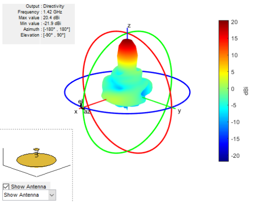
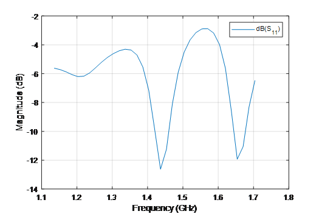
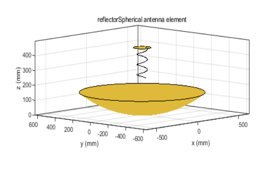

# simulation_umbrella_antenna_with_matlab

## 介绍

关于代码和实践的介绍见于
http://radioastronomy.online/home/topic/41/

经典的射电望远镜为抛物面（天线），其焦点处放置天线用以收集由抛物面反射的电磁波。我们有时候也会用球面来反射电磁波，然后在其上放置天线收集电磁波。一些业余无线电爱好者会在雨伞上贴金属膜或者绑上金属网格，然后在其上放置天线制成指向性比较强的天线。尽管雨伞有很多形状，但是我们总是能买到接近球面一部分的雨伞。

故我们可以用接近球面的雨伞，然后绑上一些柔软的铁丝网，例如防蚊铁丝网，来制成球形反射面，其上放置一个在1420MHz谐振的天线，从而形成指向性较强的球面反射天线。

馈源采用轴向螺旋天线，matlab仿真的结果如下图所示，分别为远场方向图、驻波（反射系数）、整体样貌

